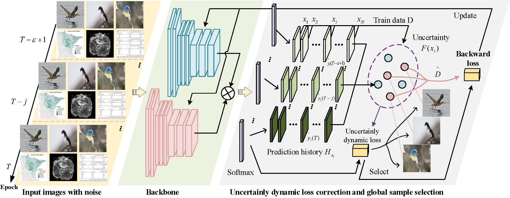
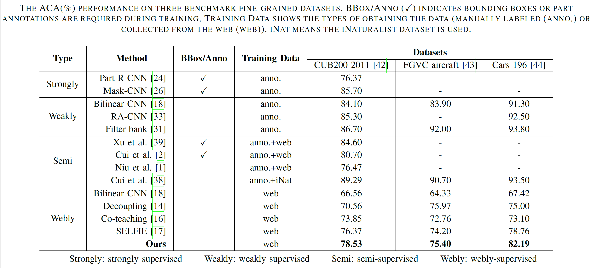

# Exploiting Web Images for Fine-Grained Visual Recognition via Dynamic Loss Correction and Global Sample Selection

## Introduction
This repository is the source code released for paper *Exploiting Web Images for Fine-Grained Visual Recognition via Dynamic Loss Correction and Global Sample Selection*

## Framework


## Installation
- clone project
  ```bash
  git clone https://github.com/NUST-Machine-Intelligence-Laboratory/dynamic-loss-correction.git
  cd dynamic-loss-correction
  ```

- Download data into project root directory and uncompress them using
  ```bash
  mkdir -p ${path_to_data}
  cd ${path_to_data}
  
  wget https://wsnfg-sh.oss-cn-shanghai.aliyuncs.com/web-bird.tar.gz
  wget https://wsnfg-sh.oss-cn-shanghai.aliyuncs.com/web-car.tar.gz
  wget https://wsnfg-sh.oss-cn-shanghai.aliyuncs.com/web-aircraft.tar.gz
  tar -xvf web-bird.tar.gz
  tar -xvf web-car.tar.gz
  tar -xvf web-aircraft.tar.gz
  ```
- soft link to data
  ```bash
  cd dynamic-loss-correction
  ln -s ${path_to_data} data
  ```
  
## Requirements
  ```bash
  python 3.x
  pytorch >= 1.7
  ```
  
## run training code
- modify the training script
  ```bash
  # modify the training script for web-cars
  #!/usr/bin/env bash
  export CUDA_VISIBLE_DEVICES=1,2
  ###step1--drop_rate 0.2 --queue_size 10 --warm_up 15
  ###step2--drop_rate 0.2 --queue_size 10 --warm_up 10
  python main.py --root ${path_to_data} --dataset web-car --n_classes 196 --base_lr 0.001 --batch_size 64 --epoch 100 --drop_rate 0.2 --queue_size 10 --warm_up 15 --weight_decay 1e-8 --step 1
  sleep 30
  python main.py --root ${path_to_data} --dataset web-car --n_classes 196 --base_lr 0.0001 --batch_size 18 --epoch 100 --drop_rate 0.2 --queue_size 10 --warm_up 10 --weight_decay 1e-5 --step 2
  ```
  
- run scripts
```bash
  ./web_cars.sh
  ```

## performance



